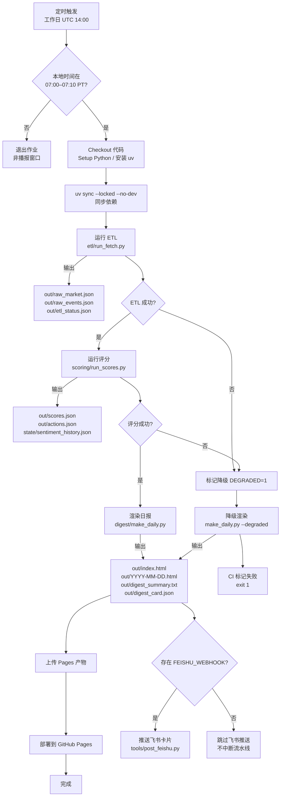

# 每日简报 Daily Messenger

一个端到端的自动化市场情报流水线：抓取行情与事件 → 计算主题得分 → 渲染网页/摘要 → 分发飞书卡片。本文档是项目的「唯一事实」，涵盖架构、配置、运行、测试与运维细节。

## 项目概览

* **场景**：为内部投研或舆情团队每天生成盘前情报，GitHub Actions 按工作日 UTC 14:00 触发，产物发布到 GitHub Pages，并可同步推送飞书群机器人。

* **语言与运行时**：Python 3.11；默认使用 [uv](https://github.com/astral-sh/uv) 管理依赖和执行命令。

* **输入**：多家行情/宏观/情绪数据提供商的 HTTP API、RSS 与 Atom Feed；凭证通过 `API_KEYS` 注入。

* **输出**：`out/` 目录下的结构化 JSON、HTML 报告、摘要文本与飞书互动卡片。

## 项目运行流程图



## 流水线一览

| 阶段 | 入口脚本 | 关键输入 | 主要输出 | 降级策略 |
| ---- | -------- | -------- | -------- | -------- |
| 数据抓取 | `etl/run_fetch.py` | API 凭证、配置文件 | `raw_market.json`、`raw_events.json`、`etl_status.json` | 缺失数据时回退模拟函数并记录 `FetchStatus` |
| 情绪与主题评分 | `scoring/run_scores.py` | `out/raw_*.json`、`state/` 历史 | `scores.json`、`actions.json`、`state/sentiment_history.json` | 可通过 `--force` 忽略缓存，缺口数据视为降级 |
| 报告渲染 | `digest/make_daily.py` | `scores.json`、`actions.json` | `index.html`、`YYYY-MM-DD.html`、`digest_summary.txt`、`digest_card.json` | `--degraded` 或 `scores.json` 标记触发醒目提示 |
| 飞书通知 | `tools/post_feishu.py` | 卡片 JSON、摘要文本 | 飞书机器人消息 | 缺少 Webhook 时跳过但不中断流水线 |

更多业务背景与数据源说明见 [docs/data_source.md](docs/data_source.md)。

## 仓库与持久化布局

```text
repo/
  etl/                 # 数据抓取器与降级模拟
  scoring/             # 主题评分、权重与阈值
  digest/              # Jinja2 模板、网页/卡片生成
  tools/               # 飞书推送、打包工具
  config/              # weights.yml 等配置清单
  project_tools/       # CI/审计辅助脚本
  tests/               # Pytest 与测试夹具
  .github/workflows/   # 自动化流水线（GitHub Actions）
  out/                 # 运行时输出（默认忽略入库）
  state/               # 幂等标记与情绪历史（默认忽略入库）
```

`out/` 与 `state/` 会在首次运行时创建；生产环境建议映射到持久化磁盘以保留历史记录。

## 凭证与配置

1. 复制模板并填写真实凭证：

   ```bash
   cp api_keys.json.example api_keys.json
   ```

2. 以任意方式注入凭证（脚本按优先级查找）：

   * `API_KEYS_PATH=/path/to/api_keys.json`
   * `API_KEYS='{"alpha_vantage":"...","finnhub":"..."}'`
   * 环境变量形式：`ALPHA_VANTAGE=...`、`TRADING_ECONOMICS_USER=...` 等

   支持键：`alpha_vantage`、`twelve_data`、`financial_modeling_prep`、`trading_economics`、`finnhub`、`ai_feeds`、`arxiv`、`coinbase`、`okx`。

3. 调整权重与阈值：修改 `config/weights.yml` 并同步更新测试断言（见 `tests/`）。

缺失凭证或接口异常时，`etl/run_fetch.py` 会写入 `out/etl_status.json`，同时触发模拟数据或历史回退，流水线仍可完成但会被标记为降级模式。

## 环境准备

### 使用 uv（推荐）

```bash
uv sync --group dev
```

`uv sync` 会根据 `pyproject.toml` 与 `uv.lock` 创建隔离环境（默认 `.venv/`），并安装运行时依赖；通过 `--group dev` 额外拉取测试与工具链。使用 `uv run <command>` 在同一环境内执行脚本。

### 使用 venv + pip（备选）

```bash
python -m venv .venv
source .venv/bin/activate
pip install -e .
pip install pytest pytest-cov ruff
```

## 本地运行流水线

```bash
# 1. 抓取行情、情绪、事件（必要时附加 --force 刷新当日缓存）
uv run python etl/run_fetch.py

# 2. 计算三大主题得分与操作建议
uv run python scoring/run_scores.py --force

# 3. 渲染网页、摘要与飞书卡片（--degraded 可强制提示数据缺口）
uv run python digest/make_daily.py
```

执行完成后，`out/` 目录包含：

* `raw_market.json`、`raw_events.json`、`etl_status.json`（抓取详情与状态）
* `scores.json`、`actions.json`（主题总分、指标拆解与建议）
* `index.html`、`YYYY-MM-DD.html`（静态日报页面）
* `digest_summary.txt`（文本摘要，多用于飞书或邮件）
* `digest_card.json`（飞书互动卡片结构体）

## 幂等控制与降级提示

* `state/fetch_YYYY-MM-DD`：标记当日 ETL 已完成，避免重复访问数据源。
* `state/done_YYYY-MM-DD`：标记评分完成，若需重跑使用 `--force` 删除标记。
* `state/sentiment_history.json`：累积 Put/Call、AAII 等情绪序列，用于平滑得分。
* 降级触发条件：`out/etl_status.json` 中任一 `ok=false`、`scores.json` 标记 `degraded=true`、命令行传入 `--degraded`。降级状态会在网页、摘要与卡片中显著提示。

## 飞书推送

```bash
export FEISHU_WEBHOOK=https://open.feishu.cn/xxx
uv run python tools/post_feishu.py \
  --webhook "$FEISHU_WEBHOOK" \
  --summary out/digest_summary.txt \
  --card out/digest_card.json
```

可选设置 `FEISHU_SECRET` 以启用签名校验；缺少 Webhook 时脚本会安全退出并提示。

## 测试与质量保障

```bash
uv run pytest                 # 单元与集成测试
uv run pytest --cov=digest    # 按需收集覆盖率
uv run ruff check .           # 代码风格检查（可附加 --fix 自动修复）
```

测试重点包括：

* ETL 对 RSS/Atom 解析与降级分支的回退行为（`tests/test_etl_ai_feeds.py`）。
* 情绪抓取器与聚合适配器的容错能力（`tests/test_sentiment_fetchers.py`）。
* 主题得分、建议生成的阈值逻辑（`tests/test_scoring.py`）。
* 报告渲染、摘要裁剪与卡片生成的端到端校验（`tests/test_digest.py`）。

新增测试覆盖 `digest.run()` 的输出产物与降级标记，便于回归验证模板或链接调整。

## 自动化运维

* GitHub Actions 工作流：`.github/workflows/daily.yml`。
  * 通过 `astral-sh/setup-uv` 安装依赖，直接读取 `pyproject.toml` 与 `uv.lock`。
  * 使用 `uv run` 执行 ETL → 评分 → 渲染 → 推送，全程复用本地一致的隔离环境。
  * 在美西时间 07:00–07:10 的时间窗外自动跳过，以避免非交易时段误触发。
  * 产出 `out/` 目录并上传至 GitHub Pages，同时根据 `FetchStatus` 决定是否附带降级提醒。
* 失败排查：检查工作流日志中的 `etl_status.json` 摘要、飞书推送步骤的输出，以及 GitHub Pages 产物是否生成。
* 如需在工作日外试跑，可使用 `workflow_dispatch` 手动触发。

## 常见问题

* **报错 `缺少输入文件`**：确认已运行 `etl/run_fetch.py` 与 `scoring/run_scores.py`，或检查 `out/` 是否映射到持久化存储。
* **API 限频或超时**：查看 `out/etl_status.json` 的失败条目；必要时增加 `config/weights.yml` 中对该数据源的权重降级方案。
* **飞书推送失败**：确保 `FEISHU_WEBHOOK`、`FEISHU_SECRET` 正确，且机器人已开启自定义应用权限。

欢迎在 `project_tools/` 中扩展校验或打包脚本，并在新增数据源时更新本文档与对应测试。
