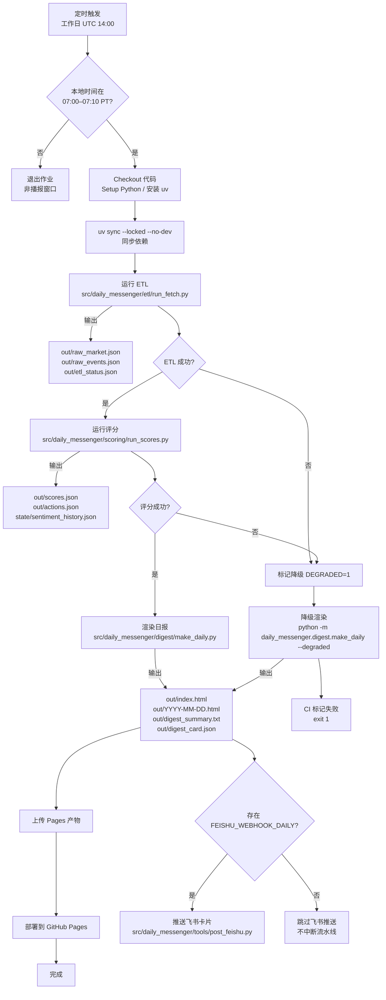
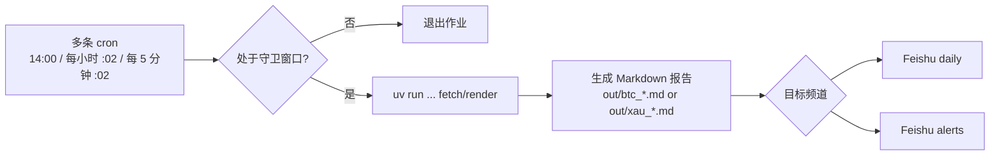

# 每日简报 Daily Messenger

一个端到端的自动化市场情报流水线：抓取行情与事件 → 计算主题得分 → 渲染网页/摘要 → 分发飞书卡片。

## Quickstart

```bash
# 1) 安装 uv（一次性）
# 详见 https://github.com/astral-sh/uv

# 2) 拉取与 CI 一致的运行时依赖
uv sync --locked --no-dev

# 3) 最小化运行（无密钥会触发降级但仍能产出）
API_KEYS='{}' uv run dm run --force-score
# 常用旗标：--date YYYY-MM-DD, --force-fetch, --force-score, --degraded
```

> 定时执行窗口：主日报 `daily-digest` 在工作日 UTC 14:00 触发，并校验是否处于 07:00–07:10 PT 播报窗口，超出即退出。BTC/XAU 监控工作流按照每小时与每 5 分钟计划触发，额外受 06:00–16:35 ET 守卫限制；详见下文工作流总览。
>
> Windows 提示：建议使用 WSL2；若直接在 PowerShell 下运行，可跳过 `.envrc`，改用 `setx` / `$env:VAR` 设置环境变量，再执行同样的 `uv` 命令。

## 常用命令速记

* `uv sync --locked --no-dev`：本地环境与 CI 保持一致。

* `uv run dm run --force-score`：强制评分的一键流水线（默认读取 `API_KEYS` 或回退到降级路径）。

> 浏览器链路（可选）：完整复现 ETF 资金流抓取需额外安装 Node.js 20 与 Playwright。CI 会预装，本地如仅需最小化运行可跳过；若要调试该链路可参考下文“环境准备”。

## 项目概览

* 场景：为内部投研或舆情团队每天生成盘前情报。主日报工作流 `daily-digest` 仍在工作日 UTC 14:00 产出网页与卡片，BTC/XAU 监控工作流按小时与 5 分钟补充盘中快照（详见下文“GitHub Actions 工作流总览”）。

* 自动化触发：所有工作流均由 cron 与手动 `workflow_dispatch` 驱动，常规 `git push` 不会触发。日报链路受 07:00–07:10 PT 窗口保护，资产监控任务遵循 06:00–16:35 ET 守卫，超出窗口会立即退出且不会重排。

* 语言与运行时：Python 3.11；默认使用 [uv](https://github.com/astral-sh/uv) 管理依赖和执行命令。

* 输入：多家行情/宏观/情绪数据提供商的 HTTP API、RSS 与 Atom Feed；凭证通过 `API_KEYS` 注入。

* 输出：`out/` 目录下的结构化 JSON、HTML 报告、摘要文本与飞书互动卡片。

## 项目运行流程图



## GitHub Actions 工作流总览

| Workflow | Cron (UTC) | 守卫窗口 | 主要产物 | 飞书频道 |
| -------- | ---------- | -------- | -------- | -------- |
| `daily-digest` | `0 14 * * 1-5` | 07:00–07:10 PT | `out/index.html`, `out/digest_card.json` | `daily` |
| `btc-d` | `0 14 * * 1-5` | 07:00–07:10 PT | `out/btc_report_daily.md` | `daily` |
| `btc-h1` | `2 * * * 1-5` | 06:00–16:35 ET | `out/btc_report_h1.md` | `alerts` |
| `btc-m1` | `2-59/5 * * * 1-5` | 06:00–16:35 ET | `out/btc_report_m1.md` | `alerts` |
| `xau-d` | `0 14 * * 1-5` | 06:00–16:35 ET | `out/xau_report_daily.md` | `daily` |
| `xau-h1` | `2 * * * 1-5` | 06:00–16:35 ET | `out/xau_report_h1.md` | `alerts` |
| `xau-m5` | `2-59/5 * * * 1-5` | 06:00–16:35 ET | `out/xau_report_m5.md` | `alerts` |

> 说明：资产监控工作流使用 `concurrency` 互斥，窗口外立即退出以避免无意义调用；`btc-d` 与主日报共享 07:00–07:10 PT 播报窗口，其余 BTC/XAU 任务均限定在纽市 06:00–16:35 ET。



## 流水线一览

| 阶段 | 入口脚本 | 关键输入 | 主要输出 | 降级策略 |
| ---- | -------- | -------- | -------- | -------- |
| 数据抓取 | `src/daily_messenger/etl/run_fetch.py` | API 凭证、配置文件 | `raw_market.json`、`raw_events.json`、`etl_status.json` | 缺失数据时回退模拟函数并记录 `FetchStatus` |
| 情绪与主题评分 | `src/daily_messenger/scoring/run_scores.py` | `out/raw_*.json`、`state/` 历史 | `scores.json`、`actions.json`、`state/sentiment_history.json` | 可通过 `--force` 忽略缓存，缺口数据视为降级 |
| 报告渲染 | `src/daily_messenger/digest/make_daily.py` | `scores.json`、`actions.json` | `index.html`、`YYYY-MM-DD.html`、`digest_summary.txt`、`digest_card.json` | `--degraded` 或 `scores.json` 标记触发醒目提示 |
| 飞书通知 | `src/daily_messenger/tools/post_feishu.py` | 卡片 JSON、摘要文本 | 飞书机器人消息 | 缺少 Webhook 时跳过但不中断流水线 |

## 数据源与字段映射

| 数据域 | 主数据源 | 备用/降级途径 | 关键输出字段 |
| ------ | -------- | ------------- | ------------ |
| 指数与主题行情 | Financial Modeling Prep、Alpha Vantage、Twelve Data；必要时读取 Alpaca | Stooq/Yahoo 历史 K 线兜底，最后回退到确定性模拟 `_simulate_market_snapshot()` | `out/raw_market.json.market.indices`、`market.themes`、`market.sectors` |
| 港股行情 | Stooq HSI、Yahoo Finance HSI | Yahoo 代理 ETF（2800/2828）或报错 | `out/raw_market.json.market.hk_indices` |
| BTC 主题 | Coinbase 现货、OKX 永续 funding 与基差、SoSoValue ETF 净流入 | 历史缓存、回退函数 `_simulate_btc_theme()` | `out/raw_market.json.btc` |
| 情绪指标 | Cboe Put/Call CSV、AAII Sentiment | 使用上一期缓存写入 `state/sentiment_history.json` | `out/raw_market.json.sentiment`、`state/sentiment_history.json` |
| 宏观与事件 | Trading Economics 日历、Finnhub 财报、AI 新闻 RSS、arXiv API | 人工模拟事件 `_simulate_events()`；缺口写入降级状态 | `out/raw_events.json.events`、`out/etl_status.json.sources` |
| AI 市场资讯 | Google Gemini（`ai_news` 配置） | 多把 API key 自动轮换；未配置时跳过并记录说明 | `out/raw_events.json.ai_updates`（含 `market`、`summary`、`prompt_date` 等字段） |

> 所有数据抓取均记录到 `out/etl_status.json`，有利于排障与降级判定。

## 仓库与持久化布局

```text
repo/
  src/
    daily_messenger/
      cli.py            # CLI 入口
      common/           # 日志、运行元数据等共享组件
      digest/           # 模板与日报渲染逻辑
      etl/              # 数据抓取器与降级模拟
      scoring/          # 主题评分、权重与阈值
      tools/            # 飞书推送等辅助脚本
  config/               # weights.yml 等配置清单
  project_tools/        # CI/运维辅助脚本
  tests/                # Pytest 与测试夹具
  .github/workflows/    # 自动化流水线（GitHub Actions）
  out/                  # 运行时输出（默认忽略入库）
  state/                # 幂等标记与情绪历史（默认忽略入库）
```

`out/` 与 `state/` 会在首次运行时创建；生产环境建议映射到持久化磁盘以保留历史记录。

## 凭证与配置

1. 复制模板并填写真实凭证：

    ```bash
    cp api_keys.json.example api_keys.json
    ```

2. 以任意方式注入凭证（脚本按优先级查找）：

    * `API_KEYS_PATH=/path/to/api_keys.json`

    * `API_KEYS='{"alpha_vantage":"...","finnhub":"..."}'`

    * 环境变量形式：`ALPHA_VANTAGE=...`、`TRADING_ECONOMICS_USER=...` 等

    支持键：`alpha_vantage`、`twelve_data`、`financial_modeling_prep`、`trading_economics`、`finnhub`、`ai_feeds`、`ai_news`、`arxiv`、`coinbase`、`okx`、`sosovalue`、`alpaca_key_id`、`alpaca_secret`。

### Gemini 市场资讯（可选）

* 18:00（北京时间）日报会串行调用 Gemini `generateContent`，分别汇总美股、日股、港股、A 股与黄金上一完整交易日的市场资讯。模型默认为 `gemini-2.5-pro`，提示词内置合规提醒并要求输出放在 `<news>...</news>` 标签中。
* 配置方式：在 `api_keys.json` 或 `API_KEYS` 内联 JSON 中新增 `ai_news` 段，例如：

    ```json
    {
      "ai_news": {
        "model": "gemini-2.5-pro",
        "enable_network": true,
        "keys": [
          "GEMINI_PRIMARY_KEY",
          "GEMINI_BACKUP_KEY",
          "GEMINI_RESERVE_KEY"
        ]
      }
    }
    ```

    `keys` 数组支持多个凭证（建议至少三把，以便阶梯降配额），流水线会遇到配额/错误时自动轮换。可选字段 `extra_prompt` 用于追加自定义提示语。

    若云端环境难以挂载 JSON，可改用环境变量（示例参见 `.env.example`）：

    ```dotenv
    GEMINI_MODEL=gemini-2.5-pro
    GEMINI_ENABLE_NETWORK=1
    GEMINI_KEY_1=your_gemini_key_1
    GEMINI_API_KEY_2=your_gemini_key_2
    GEMINI_RESERVE_KEY=your_gemini_key_3
    ```

    配置解析器会自动把这些环境变量与 `ai_news` 段合并，优先级为文件/内联 JSON → 环境变量。

* 生成结果写入 `out/raw_events.json.ai_updates`，Digest 阶段会展示该列表的前三条以供飞书卡片预览，并在 HTML 报告中展开全部条目。

### 浏览器链路与礼貌抓取变量

| 变量 | 必填 | 用途 | 获取方式 |
| ---- | ---- | ---- | -------- |
| `FARSIDE_COOKIES` | 否 | Playwright 抓取 ETF 资金流时复用的 Cookie 会话 | CI 会自动注入；本地调试可留空或从浏览器复制 |
| `FARSIDE_UA` | 否 | 覆盖默认 User-Agent 避免被拦截 | CI 使用 Playwright 生成；本地可使用浏览器 UA |
| `EDGAR_USER_AGENT` | 否 | 向 SEC EDGAR 申明身份，避免请求被拒 | 建议格式：`DailyMessenger/1.0 (contact: you@example.com)` |

> Playwright 步骤仅在需要 ETF 资金流数据时启用；缺少上述变量仍会回退至本地缓存或降级输出。

### EDGAR 礼貌示例

```bash
export EDGAR_USER_AGENT="DailyMessenger/1.0 (contact: you@example.com)"
```

3. 调整权重与阈值：修改 `config/weights.yml` 并同步更新测试断言（见 `tests/`）。

缺失凭证或接口异常时，`src/daily_messenger/etl/run_fetch.py` 会写入 `out/etl_status.json`，同时触发模拟数据或历史回退，流水线仍可完成但会被标记为降级模式。

## 权重配置与变更流程

* `config/weights.yml` 通过 `version` 与 `changed_at` 字段声明当前权重版本；所有权重调整都需同步更新测试预期（尤其是 `tests/test_scoring.py` 和 `tests/test_digest_snapshots.py`）。

* 修改阈值会直接影响 `actions.json` 与飞书卡片输出

## 环境准备

> 浏览器依赖说明：本地最小可用环境仅需 Python + uv。若要完整复现 ETF 资金流抓取的浏览器链路（与 CI 一致），请额外安装 Node.js 20 与 [Playwright](https://playwright.dev/python/docs/intro)。CI 在 `.github/workflows/daily.yml` 中通过 `setup-node` 与 `npx playwright install --with-deps` 预装这些组件，本地如需调试可按同样步骤执行。

### 使用 uv（推荐）

```bash
uv sync --locked --no-dev
```

`uv sync --locked --no-dev` 会根据 `pyproject.toml` 与 `uv.lock` 创建隔离环境（默认 `.venv/`），仅安装运行时依赖，确保与 CI 工作流一致。若需本地调试与质量工具，可额外运行 `uv sync --locked --extra dev` 拉取开发依赖。此外，可使用 `uv run <command>` 在同一环境内执行脚本。

### 使用 venv + pip（备选）

```bash
python -m venv .venv
source .venv/bin/activate
pip install -e .
pip install pytest pytest-cov ruff
```

## 本地运行流水线

推荐使用统一 CLI 一键跑完整流水线：

```bash
uv run dm run --force-score
```

常用旗标：`--date 2024-04-01`（覆盖交易日，供回溯测试）、`--force-fetch` / `--force-score`（跳过幂等标记，强制刷新）、`--degraded`（在渲染阶段标记降级输出）、`--disable-throttle`（禁用抓取端的节流休眠，受控环境使用）。

保留原始子命令亦可单独执行：

```bash
uv run dm fetch              # 抓取行情、情绪、事件
uv run dm score --force      # 计算主题得分与建议
uv run dm digest             # 渲染网页、摘要、卡片
```

上述三条 `uv run dm ...` 指令分别等价于 `uv run python -m daily_messenger.etl.run_fetch`、`uv run python -m daily_messenger.scoring.run_scores --force`、`uv run python -m daily_messenger.digest.make_daily`，首选 `uv run dm run` 在一次执行内串联全部阶段。

### 命令速查表

| 命令 | 作用 | 常用旗标 |
| ---- | ---- | -------- |
| `uv run dm run` | 串联抓取 → 评分 → 渲染 | `--date`、`--force-fetch`、`--force-score`、`--degraded`、`--strict`、`--disable-throttle` |
| `uv run dm fetch` | 仅执行 ETL | `--date`、`--force`、`--disable-throttle` |
| `uv run dm score` | 仅执行评分 | `--date`、`--force`、`--strict` |
| `uv run dm digest` | 仅执行渲染 | `--date`、`--degraded` |

> 提示：也可通过设置 `DM_DISABLE_THROTTLE=1` 达成与 `--disable-throttle` 相同的效果。

### BTC 工具子命令

`dm btc` 将比特币冷启动、增量抓取与 Markdown 日报纳入同一个入口，便于 CI 与本地复用。

```bash
uv run dm btc init-history --interval 1d --start 2024-01-01 --end 2024-04-01
uv run dm btc fetch --interval 1h --lookback 5d
uv run dm btc report --config config/ta_btc_daily.yml --out out/btc_report_daily.md
```

* `init-history`：一次性从 Binance 下载压缩包并写入 `out/btc/klines_<interval>.parquet`。

* `fetch`：按回看窗口增量刷新 Binance → Kraken → Bitstamp，优雅降级。

* `report`：读取 1d/1h/1m Parquet，生成技术面 Markdown 报告，可通过 `--config` 切换到 `config/ta_btc_*.yml` 控制段落。

## CLI 帮助（自动生成）

`project_tools/update_cli_help.py` 会调用 `python -m daily_messenger.cli --help` 并更新下方代码块，确保 README 与实际 CLI 同步；在 CI 中可运行 `uv run python project_tools/update_cli_help.py --check` 自动守护是否漂移：

<!-- cli-help:start -->
```text
$ dm --help
usage: dm [-h] {run,fetch,score,digest,btc} ...

Daily Messenger CLI

positional arguments:
  {run,fetch,score,digest,btc}
    run                 Run ETL, scoring, and digest sequentially
    fetch               Run ETL only
    score               Run scoring only
    digest              Render digest only
    btc                 BTC monitoring helpers

options:
  -h, --help            show this help message and exit

$ dm run --help
usage: dm run [-h] [--date DATE] [--force-fetch] [--force-score] [--degraded]
              [--strict] [--disable-throttle]

options:
  -h, --help          show this help message and exit
  --date DATE         Override trading day (YYYY-MM-DD)
  --force-fetch       Force refresh ETL step
  --force-score       Force recompute scoring step
  --degraded          Render digest in degraded mode
  --strict            Enable STRICT mode during scoring
  --disable-throttle  Disable network throttling helpers

$ dm fetch --help
usage: dm fetch [-h] [--date DATE] [--force] [--disable-throttle]

options:
  -h, --help          show this help message and exit
  --date DATE         Override trading day (YYYY-MM-DD)
  --force             Force refresh ETL step
  --disable-throttle  Disable network throttling helpers

$ dm score --help
usage: dm score [-h] [--date DATE] [--force] [--strict]

options:
  -h, --help   show this help message and exit
  --date DATE  Override trading day (YYYY-MM-DD)
  --force      Force recompute scoring
  --strict     Enable STRICT mode

$ dm digest --help
usage: dm digest [-h] [--date DATE] [--degraded]

options:
  -h, --help   show this help message and exit
  --date DATE  Override trading day (YYYY-MM-DD)
  --degraded   Render in degraded mode
```
<!-- cli-help:end -->

执行完成后，`out/` 目录包含：

* `raw_market.json`、`raw_events.json`、`etl_status.json`（抓取详情与状态）

* `scores.json`、`actions.json`（主题总分、指标拆解与建议）

* `index.html`、`YYYY-MM-DD.html`（静态日报页面）

* `digest_summary.txt`（文本摘要，多用于飞书或邮件）

* `digest_card.json`（飞书互动卡片结构体）

* `run_meta.json`（本次流水线的机器可读运行元数据）

> 静态预览：本地可运行 `python -m http.server -d out 8000`，再访问 `http://localhost:8000/` 检查 Pages 成品。

## 产物契约

以下示例定义了关键文件的最小字段集。任何破坏这些契约的改动都必须在本节同步更新。

> 变更提示：凡涉及契约字段、`config/weights.yml` 或模板的改动，必须在同一 PR 内更新示例、相应快照，以及 `pytest -k contract` 用例，否则 CI 会拒绝合并。

### `out/etl_status.json`

```json
{
  "date": "2024-04-01",
  "ok": true,
  "sources": [
    {"name": "market", "ok": true, "message": "示例行情生成完毕"},
    {"name": "cboe_put_call", "ok": false, "message": "使用上一期 Put/Call 数据"}
  ]
}
```

* `ok=false` 表示进入降级模式；`sources` 列表记录每个抓取器的状态与补救信息。

### `out/scores.json`

```json
{
  "date": "2024-04-01",
  "degraded": false,
  "themes": [
    {
      "name": "ai",
      "label": "AI",
      "total": 82.3,
      "breakdown": {
        "fundamental": 78.0,
        "valuation": 65.0,
        "sentiment": 58.0,
        "liquidity": 62.0,
        "event": 55.0
      },
      "breakdown_detail": {
        "fundamental": {"value": 78.0, "source": "主题行情"},
        "valuation": {"value": 65.0, "fallback": false}
      },
      "weights": {
        "fundamental": 0.3,
        "valuation": 0.15,
        "sentiment": 0.25,
        "liquidity": 0.2,
        "event": 0.1
      },
      "meta": {
        "previous_total": 79.8,
        "delta": 2.5,
        "distance_to_add": -7.3,
        "distance_to_trim": 37.3
      },
      "degraded": false
    }
  ],
  "events": [
    {"title": "收益季焦点", "date": "2024-04-02", "impact": "high"}
  ],
  "thresholds": {"action_add": 85, "action_trim": 45},
  "etl_status": {"ok": true, "sources": []},
  "sentiment": {"score": 56.0, "put_call": 52.0, "aaii": 48.0},
  "config_version": 2,
  "config_changed_at": "2024-04-01"
}
```

* `themes` 数组中的每个对象必须保留 `name`、`label`、`total`、`breakdown` 与 `weights` 字段。

* `sentiment` 结构来源于情绪聚合器，若缺失则整个字段应省略。

* 可选字段：`theme_details`（用于渲染主题成分预览）、`ai_updates`（AI 事件补充）、`config_version` / `config_changed_at`（当前权重版本元数据）。出现时请按原结构保留，避免模板或合同测试缺项。

### `out/actions.json`

```json
{
  "date": "2024-04-01",
  "items": [
    {"action": "增持", "name": "AI", "reason": "总分高于增持阈值"}
  ]
}
```

* `items` 顺序由评分结果决定；未命中阈值时 `items` 为空数组。

### `state/sentiment_history.json`

```json
{
  "put_call_equity": [0.72, 0.68, 0.65],
  "aaii_bull_bear_spread": [-10.0, -8.5]
}
```

* 该文件保留近 252 个 Put/Call 值与 104 个 AAII 值，供下一次运行计算情绪 Z 分数。

### `out/digest_card.json`

```json
{
  "config": {"wide_screen_mode": true},
  "header": {
    "template": "blue",
    "title": {"tag": "plain_text", "content": "内参 · 盘前"}
  },
  "elements": [
    {
      "tag": "div",
      "text": {"tag": "lark_md", "content": "AI 总分 82｜基本面 78"}
    },
    {
      "tag": "action",
      "actions": [
        {
          "tag": "button",
          "text": {"tag": "plain_text", "content": "查看完整报告"},
          "url": "https://example.github.io/daily-messenger/2024-04-01.html",
          "type": "default"
        }
      ]
    }
  ]
}
```

* 卡片结构遵循飞书互动卡片 JSON 协议；渲染阶段会根据 `--degraded` 在标题与内容中追加“（数据延迟）”。

### 报告模板可选字段

* `raw_links`（字典，可选）—— 用于在 HTML 模板底部渲染 “原始产物” 链接，默认键包含 `market` 与 `events`。如需覆盖链接或追加更多原始文件，请扩展该映射而非删除。
* `news_preview` / `stock_preview`（列表，可选）—— 当存在对应素材时，摘要与飞书卡片会将其拼接到标题下方。缺失时应保留空列表或省略字段，避免模板逻辑出错。

## 幂等控制与降级提示

| 标记文件 | 生成节点 | 作用 | 清理建议 |
| -------- | -------- | ---- | -------- |
| `state/fetch_YYYY-MM-DD` | ETL 成功写出 `raw_market.json`、`raw_events.json` | 防止重复抓取同一交易日；存在但缺少对应产物时会自动忽略 | 回溯或补数前手动删除对应日期 |
| `state/done_YYYY-MM-DD` | 评分成功写出 `scores.json` | 阻止重复计算同一交易日得分 | 调整配置或修复数据时附带 `--force-score` 或删除 |
| `state/sentiment_history.json` | 评分阶段更新 | 保存 Put/Call、AAII 时间序列 | 若格式损坏可删除，系统会重建但失去历史 |
| `state/score_history.json` | 评分阶段更新 | 按主题保存近 30 日总分历史 | 仅在需要重建历史时删除 |
| `out/run_meta.json` | 各阶段调用 `run_meta.record_step()` | 汇总所有阶段状态、耗时与降级标记 | 调试完成后可留存以供审计 |

* 降级触发条件：`out/etl_status.json.ok=false`、`scores.json.degraded=true` 或 CLI 传入 `--degraded`。降级状态会在网页、摘要与卡片中显著提示。

### 常见降级路径速查

| 场景 | 触发条件 | 回退行为 | 自助处理 |
| ---- | -------- | -------- | -------- |
| BTC 主题行情 | Binance/Kraken/Bitstamp 全部不可用 | 读取最近成功产出的 Parquet，必要时写入 `degraded=true` | 手动执行 `uv run dm btc fetch` 或检查网络代理 |
| 港股指数 | Stooq/Yahoo 接口超时或 429 | 使用上一交易日缓存；若无缓存则标记降级 | 更新 API 密钥、增加本地缓存或放宽抓取窗口 |
| 情绪指标 (Put/Call, AAII) | CSV 下载失败、解析异常 | 使用 `state/sentiment_history.json` 最新值 | 手动补录 CSV 或删除 `state/` 对应键重新拉取 |
| 宏观/事件 | Trading Economics/Finnhub 超时 | 回退到 `_simulate_events()` 并在产物中注明 | 稍后重跑 `uv run dm fetch --force` |
| ETF 资金流 | Playwright/Farside Cookie 过期 | 标记 `fallback`，报告中提示数据延迟 | 重新采集 `FARSIDE_COOKIES/U A` 或降级到缓存 |

## 飞书推送

> 缺少对应频道的 Webhook（`FEISHU_WEBHOOK_DAILY` / `FEISHU_WEBHOOK_ALERTS`）时脚本会记录告警并以 0 退出码收尾，不会阻断 CI。

```bash
export FEISHU_WEBHOOK_DAILY=https://open.feishu.cn/xxx
export FEISHU_SECRET_DAILY=xxxxxxxx
export FEISHU_WEBHOOK_ALERTS=https://open.feishu.cn/yyy
export FEISHU_SECRET_ALERTS=yyyyyyyy

# 日报/小时总结（默认使用互动卡片）
uv run python -m daily_messenger.tools.post_feishu \
  --channel daily \
  --summary out/digest_summary.txt \
  --card out/digest_card.json

# 盘中告警（text post）
uv run python -m daily_messenger.tools.post_feishu \
  --channel alerts \
  --mode post \
  --summary out/alerts_snapshot.txt
```

* 如未显式指定 `--webhook` / `--secret`，脚本将按 `channel` 读取 `FEISHU_WEBHOOK_<CHANNEL>` 与 `FEISHU_SECRET_<CHANNEL>`。

* 仍可直接运行 `uv run python -m daily_messenger.tools.post_feishu`，若 `out/digest_card.json` 存在则发送互动卡片，否则退化到 `post` 模式；缺少 Webhook 时安全跳过。

## XAU/USD 技术分析报告

黄金技术面报告使用 `config/ta_xau_*.yml` 描述指标窗口与产物路径，通过 OANDA Practice REST 获取日线、小时与 5 分钟 midpoint K 线，计算 SMA50/200、RSI14、ATR14 与前一交易日枢轴点。按需选择配置可得到日报与盘中快照：

```bash
export OANDA_TOKEN=xxxxxxxxxxxxxxxx
uv run python -m daily_messenger.digest.ta_report --config config/ta_xau_daily.yml  # out/xau_report_daily.md
uv run python -m daily_messenger.digest.ta_report --config config/ta_xau_h1.yml     # out/xau_report_h1.md
uv run python -m daily_messenger.digest.ta_report --config config/ta_xau_m5.yml     # out/xau_report_m5.md
```

`ta_xau_daily.yml` 关闭 `include_intraday` 专注于日终摘要，`ta_xau_h1.yml` 与 `ta_xau_m5.yml` 分别保留 H1/M5 快照并复用相同的指标与阈值。需要“一次生成全量段落”时仍可使用历史配置 `config/ta_xau.yml`。

对应的 GitHub Actions：

* `xau-d`：工作日 UTC 14:00 触发，受 06:00–16:35 ET 守卫限制，向 `daily` 频道发送 `out/xau_report_daily.md`。
* `xau-h1`：每小时 :02 执行，窗口守卫同上，仅生成小时级 Markdown 并推送 `alerts`。
* `xau-m5`：交易时段内每 5 分钟 :02 执行，产出 `out/xau_report_m5.md` 并推送 `alerts`。

提示：OANDA 返回的 volume 是 tick 计数，适用于波动度评估，不等同于交易所成交量。生产环境请根据需要替换为正式实时数据源。

## BTC/USDT 技术简报

BTC 技术面报告使用 `dm btc` 子命令维护 1m/1h/1d K 线并生成 Markdown 摘要，可配合不同配置文件产出日报与盘中快照。

```bash
uv run dm btc fetch --interval 1d --lookback 10d
uv run dm btc report --config config/ta_btc_daily.yml --out out/btc_report_daily.md
uv run dm btc fetch --interval 1h --lookback 5d
uv run dm btc report --config config/ta_btc_h1.yml --out out/btc_report_h1.md
uv run dm btc fetch --interval 1m --lookback 2d
uv run dm btc report --config config/ta_btc_m1.yml --out out/btc_report_m1.md
```

* 抓取器按 Binance → Kraken → Bitstamp 顺序回退，写入 `out/btc/klines_<interval>.parquet` 并记录降级状态。
* 报告默认计算 SMA50/200、RSI14、ATR14 与枢轴位，可通过 `config/ta_btc.yml` 或上述专用配置调整标题、是否包含 H1/M1 段落。

对应的 GitHub Actions：

* `btc-d`：工作日 UTC 14:00（07:00–07:10 PT 窗口内）刷新 1d 数据并输出 `out/btc_report_daily.md`，推送至 `daily`。
* `btc-h1`：每小时 :02 触发，仅刷新 1h K 线并生成 `out/btc_report_h1.md`，推送至 `alerts`。
* `btc-m1`：交易时段内每 5 分钟 :02 触发，刷新 1m 数据后生成 `out/btc_report_m1.md` 并推送 `alerts`。

## 日志与观测

* 全部入口脚本使用结构化 JSON 日志输出(`stdout`)，字段包含 `run_id`、`component`、`trading_day` 等，方便在 CI/日志平台聚合检索。可自定义 `DM_RUN_ID=<uuid>` 以串联多步流水数据。

* `out/run_meta.json` 记录每个阶段的状态、耗时与降级标记，适合接入额外的监控或趋势分析。

* 抓取阶段的节流可通过 `DM_DISABLE_THROTTLE=1` 显式关闭（默认遵循配置或内置延迟，建议仅在受控环境使用）。

## 故障排查指南

10 秒自检：

1. 查看 `out/run_meta.json`，确认哪个阶段首次返回 `status != "ok"`。

2. 打开 `out/etl_status.json`，核对缺失数据源与 `message` 提示。

3. 检查当前 shell 是否注入了 `API_KEYS` / `API_KEYS_PATH` 及浏览器链路变量。

4. 对照本地时间是否落在 07:00–07:10 PT 播报窗口（CI 同样受限）。

5. Playwright/ETF 场景：确认 `FARSIDE_COOKIES`、`FARSIDE_UA`、`EDGAR_USER_AGENT` 是否就绪，必要时重新抓取。

* 缺少 `API_KEYS`：流水线会自动进入降级模式，模拟数据会在网页与摘要顶部加粗提示，同时 `out/etl_status.json.ok=false` 与 `run_meta.json` 中的 `degraded=true`。如需验证真实接口，可在本地导入最小化凭证并重新执行。

* 未配置飞书 Webhook：当目标频道 (`FEISHU_WEBHOOK_DAILY` / `FEISHU_WEBHOOK_ALERTS`) 缺失时，推送脚本会安全跳过并返回 0，同时记录 `feishu_skip_no_webhook` 事件，不会阻断 CI。

* 如何定位缺失字段：结构化日志输出在 `out/run_meta.json` 中可按步骤查状态；产物契约失配时，请对照下文“产物契约”示例，同时运行 `pytest -k contract` 触发合同测试以获得具体断言。

## 测试与质量保障

```bash
# 冒烟
uv run pytest -k cli_pipeline --maxfail=1

# 合同
uv run pytest -k contract

# 覆盖率 / 全量
uv run pytest --cov=daily_messenger --cov-report=term-missing --cov-fail-under=70

# 静态检查
uv run ruff check .  # 可加 --fix 自动修复
```

冒烟命令用于快速确认 CLI 端到端产物是否齐全，`-k contract` 聚焦 JSON 契约字段，覆盖率命令在提交前确保变更未降低 70% 阈值。

测试重点包括：

* ETL 对 RSS/Atom 解析与降级分支的回退行为（`tests/test_etl_ai_feeds.py`）。

* Put/Call、AAII 等情绪抓取器的容错能力（`tests/test_sentiment_fetchers.py`）。

* 主题得分与建议生成逻辑（`tests/test_scoring.py`）。

* 报告渲染、摘要裁剪与卡片生成的端到端校验（`tests/test_digest.py`、`tests/test_digest_snapshots.py`）。

* 飞书推送的 webhook 签名与容错路径（`tests/test_post_feishu.py`）。

任何修改 `config/weights.yml` 或模板的变更都应同步更新上述测试与 README 的契约示例。

## 自动化运维

* 日报：`.github/workflows/daily.yml`。

  * 工作日 UTC 14:00 触发，若当前时间不在 07:00–07:10 PT 窗口内即提前结束（以 README 约定为准）。

  * 所有步骤使用 `uv sync --locked --no-dev` 与 `uv run`，保证与本地一致的 Python 3.11 环境。

  * ETL 与评分允许 `continue-on-error`，任一失败都会设置 `DEGRADED=1` 并在渲染阶段显式降级。

  * 即使降级输出仍会上传 `out/` 到 GitHub Pages，并在最后一步根据 ETL/评分状态决定是否 `exit 1`。

  * 如配置了 `FEISHU_WEBHOOK_DAILY`，会在部署后推送最新卡片；缺失凭证则跳过且不中断流程。

* BTC 监控：`.github/workflows/btc-d.yml`、`.github/workflows/btc-h1.yml`、`.github/workflows/btc-m1.yml`。

  * `btc-d`：工作日 UTC 14:00 触发，继承 07:00–07:10 PT 守卫，仅刷新 1d K 线并推送 `out/btc_report_daily.md` 至 `daily`。

  * `btc-h1`：每小时 :02 运行，受 06:00–16:35 ET 限制；若缺少日线缓存会先补拉一次，然后刷新 1h 数据并推送 `out/btc_report_h1.md` 至 `alerts`。

  * `btc-m1`：交易时段内每 5 分钟 :02 运行，刷新 1m 数据后生成 `out/btc_report_m1.md` 并推送 `alerts`。

* 黄金监控：`.github/workflows/xau-d.yml`、`.github/workflows/xau-h1.yml`、`.github/workflows/xau-m5.yml`。

  * 三条工作流共享 06:00–16:35 ET 守卫，分别生成 `out/xau_report_daily.md`（`daily`）、`out/xau_report_h1.md`（`alerts`）、`out/xau_report_m5.md`（`alerts`）。

  * 全部使用 `concurrency` 在同一窗口内互斥执行，避免 cron 重叠造成排队。

* 所有工作流均支持 `workflow_dispatch` 手动触发；调试时可检查 `out/run_meta.json` 与结构化日志定位问题。

## 数据服务限额（仅供参考，逻辑不依赖）

下表仅供提醒，具体以各供应商官网为准；流水线逻辑不会基于下列配额做强依赖判断：

| 提供商 | 常见免费/入门限频 | 备注 |
| ------ | ---------------- | ---- |
| **Alpha Vantage** | 免费：**每天 25 次**（多数数据集可用） | 官方从“5/分 + 500/天”调整为按天配额，分钟层面仍会节流。([alphavantage.co][1]) |
| **Twelve Data** | Basic：**8 credits/分钟，800 credits/天** | 多数端点按 1 请求=1 credit 计数。([support.twelvedata.com][2]) |
| **Financial Modeling Prep (FMP)** | Free：**250 次/天**；付费档到 **300–3000 次/分钟** | 另有按带宽计费的限制。([FinancialModelingPrep][3]) |
| **Trading Economics** | **1 请求/秒**的通用限制；历史数据单次上限 10,000 行 | 日配额未公布。([docs.tradingeconomics.com][4]) |
| **Finnhub** | 社区经验：约 **60 次/分钟**，并需尊重 `Retry-After` | 请以账户控制台配置为准。([GitHub][5]) |
| **Coinbase** | Advanced Trade REST：约 **10 次/秒** 基础限速 | 命中 429 后需按 `Retry-After` 回退；公共与私有 key 限速不同。([docs.cloud.coinbase.com](https://docs.cloud.coinbase.com/sign-in-with-coinbase/docs/rate-limits)) |
| **OKX** | 公共 REST：**20 次/2 秒/端点**；私有 REST：**10 次/2 秒/端点** | 触发限流返回 `code=50011`，需等待窗口刷新。([www.okx.com][6]) |
| **SoSoValue** | 官方未公布，常见体验为 **几十次/分钟** | ETF 数据按 API Key 计数，超限会短暂冻结。([docs.sosovalue.com][7]) |
| **Alpaca** | Market Data 免费档：**200 次/分钟，50,000 次/日** | 仅作行情兜底，历史数据会按 symbol/时段额外节流。([alpaca.markets][8]) |
| **Coinbase/OKX 替补源** | Websocket 订阅通常限 **20 频道/连接** | 遇到断流需指数退避重连。 |
| **Stooq / Yahoo Finance** | 无官方数字，为共享公共源 | 自觉限速并缓存响应，避免触发封禁。 |
| **Cboe Put/Call** | 建议 **≤1 次/分钟** 拉取 CSV | 站点过载会直接断开连接，需做指数退避。 |
| **AAII Sentiment** | 官方每周更新，建议 **≤1 次/日** | 缓存即可满足需求，避免无意义的重复请求。 |
| **arXiv / AI RSS** | arXiv：官方建议 **≤1 次/3 秒**；RSS：**10–15 分钟/次** | 遵守 `User-Agent`、`If-Modified-Since` 等礼貌抓取规范。([arxiv.org][9]) |

[1]: https://www.alphavantage.co/support/#api-key
[2]: https://support.twelvedata.com/en/articles/2412741-credits-explained
[3]: https://financialmodelingprep.com/developer/docs
[4]: https://docs.tradingeconomics.com/
[5]: https://github.com/Finnhub-Stock-API/finnhub-python
[6]: https://www.okx.com/docs-v5/en/#rest-api-rate-limit
[7]: https://docs.sosovalue.com/reference/api-limit
[8]: https://docs.alpaca.markets/docs/market-data-api-coverage
[9]: https://info.arxiv.org/help/api/user-manual.html#submitting-queries

> 配额可能随供应商策略调整而变动；本文档不作为约束逻辑，仅作提示。
