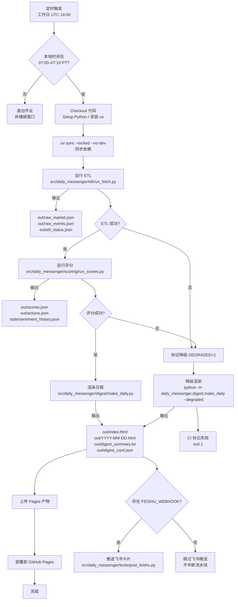

# 每日简报 Daily Messenger

一个端到端的自动化市场情报流水线：抓取行情与事件 → 计算主题得分 → 渲染网页/摘要 → 分发飞书卡片。

## Quickstart

```bash
# 1) 安装 uv（一次性）
# 详见 https://github.com/astral-sh/uv

# 2) 拉取与 CI 一致的运行时依赖
uv sync --locked --no-dev

# 3) 最小化运行（无密钥会触发降级但仍能产出）
API_KEYS='{}' dm run --force-score
# 常用参数：--date YYYY-MM-DD, --force-fetch, --force-score, --degraded
```

> ⚠️ **定时执行窗口**：GitHub Actions 仅在工作日 UTC 14:00 触发，且会校验当前是否处于 **07:00–07:10 PT** 播报窗口。超出窗口 CI 会立即退出，不会重新排程。

## 项目概览

* 场景：为内部投研或舆情团队每天生成盘前情报，GitHub Actions 按工作日 UTC 14:00 触发，产物发布到 GitHub Pages，并可同步推送飞书群机器人。
* 自动化触发：CI 仅在上述定时任务与手动 `workflow_dispatch` 下运行，常规 `git push` 不会触发；定时触发也会检测是否处于 07:00–07:10 PT 播报窗口，超出则直接退出。

* 语言与运行时：Python 3.11；默认使用 [uv](https://github.com/astral-sh/uv) 管理依赖和执行命令。

* 输入：多家行情/宏观/情绪数据提供商的 HTTP API、RSS 与 Atom Feed；凭证通过 `API_KEYS` 注入。

* 输出：`out/` 目录下的结构化 JSON、HTML 报告、摘要文本与飞书互动卡片。

## 项目运行流程图



## 流水线一览

| 阶段 | 入口脚本 | 关键输入 | 主要输出 | 降级策略 |
| ---- | -------- | -------- | -------- | -------- |
| 数据抓取 | `src/daily_messenger/etl/run_fetch.py` | API 凭证、配置文件 | `raw_market.json`、`raw_events.json`、`etl_status.json` | 缺失数据时回退模拟函数并记录 `FetchStatus` |
| 情绪与主题评分 | `src/daily_messenger/scoring/run_scores.py` | `out/raw_*.json`、`state/` 历史 | `scores.json`、`actions.json`、`state/sentiment_history.json` | 可通过 `--force` 忽略缓存，缺口数据视为降级 |
| 报告渲染 | `src/daily_messenger/digest/make_daily.py` | `scores.json`、`actions.json` | `index.html`、`YYYY-MM-DD.html`、`digest_summary.txt`、`digest_card.json` | `--degraded` 或 `scores.json` 标记触发醒目提示 |
| 飞书通知 | `src/daily_messenger/tools/post_feishu.py` | 卡片 JSON、摘要文本 | 飞书机器人消息 | 缺少 Webhook 时跳过但不中断流水线 |

## 数据源与字段映射

| 数据域 | 主数据源 | 备用/降级途径 | 关键输出字段 |
| ------ | -------- | ------------- | ------------ |
| 指数与主题行情 | Financial Modeling Prep、Alpha Vantage、Twelve Data；必要时读取 Alpaca | Stooq/Yahoo 历史 K 线兜底，最后回退到确定性模拟 `_simulate_market_snapshot()` | `out/raw_market.json.market.indices`、`market.themes`、`market.sectors` |
| 港股行情 | Stooq HSI、Yahoo Finance HSI | Yahoo 代理 ETF（2800/2828）或报错 | `out/raw_market.json.market.hk_indices` |
| BTC 主题 | Coinbase 现货、OKX 永续 funding 与基差、SoSoValue ETF 净流入 | 历史缓存、回退函数 `_simulate_btc_theme()` | `out/raw_market.json.btc` |
| 情绪指标 | Cboe Put/Call CSV、AAII Sentiment | 使用上一期缓存写入 `state/sentiment_history.json` | `out/raw_market.json.sentiment`、`state/sentiment_history.json` |
| 宏观与事件 | Trading Economics 日历、Finnhub 财报、AI 新闻 RSS、arXiv API | 人工模拟事件 `_simulate_events()`；缺口写入降级状态 | `out/raw_events.json.events`、`out/etl_status.json.sources` |

> 所有数据抓取均记录到 `out/etl_status.json`，有利于排障与降级判定。

## 仓库与持久化布局

```text
repo/
  src/
    daily_messenger/
      cli.py            # CLI 入口
      common/           # 日志、运行元数据等共享组件
      digest/           # 模板与日报渲染逻辑
      etl/              # 数据抓取器与降级模拟
      scoring/          # 主题评分、权重与阈值
      tools/            # 飞书推送等辅助脚本
  config/               # weights.yml 等配置清单
  project_tools/        # CI/运维辅助脚本
  tests/                # Pytest 与测试夹具
  .github/workflows/    # 自动化流水线（GitHub Actions）
  out/                  # 运行时输出（默认忽略入库）
  state/                # 幂等标记与情绪历史（默认忽略入库）
```

`out/` 与 `state/` 会在首次运行时创建；生产环境建议映射到持久化磁盘以保留历史记录。

## 凭证与配置

1. 复制模板并填写真实凭证：

    ```bash
    cp api_keys.json.example api_keys.json
    ```

2. 以任意方式注入凭证（脚本按优先级查找）：

    * `API_KEYS_PATH=/path/to/api_keys.json`

    * `API_KEYS='{"alpha_vantage":"...","finnhub":"..."}'`

    * 环境变量形式：`ALPHA_VANTAGE=...`、`TRADING_ECONOMICS_USER=...` 等

    支持键：`alpha_vantage`、`twelve_data`、`financial_modeling_prep`、`trading_economics`、`finnhub`、`ai_feeds`、`arxiv`、`coinbase`、`okx`、`sosovalue`、`alpaca_key_id`、`alpaca_secret`。

3. 调整权重与阈值：修改 `config/weights.yml` 并同步更新测试断言（见 `tests/`）。

缺失凭证或接口异常时，`src/daily_messenger/etl/run_fetch.py` 会写入 `out/etl_status.json`，同时触发模拟数据或历史回退，流水线仍可完成但会被标记为降级模式。

## 权重配置与变更流程

* `config/weights.yml` 通过 `version` 与 `changed_at` 字段声明当前权重版本；所有权重调整都需同步更新测试预期（尤其是 `tests/test_scoring.py` 和 `tests/test_digest_snapshots.py`）。

* 修改阈值会直接影响 `actions.json` 与飞书卡片输出

## 环境准备

> 💡 **浏览器依赖说明**：本地最小可用环境仅需 Python + uv。若要完整复现 ETF 资金流抓取的浏览器链路（与 CI 一致），请额外安装 Node.js 20 与 [Playwright](https://playwright.dev/python/docs/intro)。CI 在 `.github/workflows/daily.yml` 中通过 `setup-node` 与 `npx playwright install --with-deps` 预装这些组件，本地如需调试可按同样步骤执行。

### 使用 uv（推荐）

```bash
uv sync --locked --no-dev
```

`uv sync --locked --no-dev` 会根据 `pyproject.toml` 与 `uv.lock` 创建隔离环境（默认 `.venv/`），仅安装运行时依赖，确保与 CI 工作流一致。若需本地调试与质量工具，可额外运行 `uv sync --locked --extra dev` 拉取开发依赖。此外，可使用 `uv run <command>` 在同一环境内执行脚本。

### 使用 venv + pip（备选）

```bash
python -m venv .venv
source .venv/bin/activate
pip install -e .
pip install pytest pytest-cov ruff
```

## 本地运行流水线

推荐使用统一 CLI 一键跑完整流水线：

```bash
dm run --force-score
```

常见参数：`--date 2024-04-01`（覆盖交易日，供回溯测试）、`--force-fetch` / `--force-score`（跳过幂等标记，强制刷新）、`--degraded`（在渲染阶段标记降级输出）、`--disable-throttle`（禁用抓取端的节流休眠，受控环境使用）。

保留原始子命令亦可单独执行：

```bash
dm fetch             # 抓取行情、情绪、事件
dm score --force     # 计算主题得分与建议
dm digest            # 渲染网页、摘要、卡片
```

上述三条 `python -m ...` 指令分别等价于 `uv run python -m daily_messenger.etl.run_fetch`、`uv run python -m daily_messenger.scoring.run_scores --force`、`uv run python -m daily_messenger.digest.make_daily`，首选 `dm run` 在一次执行内串联全部阶段。

### 完整 CLI 参考

以下列表直接对应 `src/daily_messenger/cli.py` 暴露的旗标，可快速查找每个子命令的可用参数：

```text
dm run [--date YYYY-MM-DD] [--force-fetch] [--force-score] [--degraded] [--strict] [--disable-throttle]
dm fetch [--date YYYY-MM-DD] [--force] [--disable-throttle]
dm score [--date YYYY-MM-DD] [--force] [--strict]
dm digest [--date YYYY-MM-DD] [--degraded]
```

> 提示：也可通过设置 `DM_DISABLE_THROTTLE=1` 达成与 `--disable-throttle` 相同的效果。

## CLI 帮助（自动生成）

`project_tools/update_cli_help.py` 会调用 `python -m daily_messenger.cli --help` 并更新下方代码块，确保 README 与实际 CLI 同步：

<!-- cli-help:start -->
```text
usage: dm [-h] {run,fetch,score,digest} ...

Daily Messenger CLI

positional arguments:
  {run,fetch,score,digest}
    run                 Run ETL, scoring, and digest sequentially
    fetch               Run ETL only
    score               Run scoring only
    digest              Render digest only

options:
  -h, --help            show this help message and exit
```
<!-- cli-help:end -->

执行完成后，`out/` 目录包含：

* `raw_market.json`、`raw_events.json`、`etl_status.json`（抓取详情与状态）

* `scores.json`、`actions.json`（主题总分、指标拆解与建议）

* `index.html`、`YYYY-MM-DD.html`（静态日报页面）

* `digest_summary.txt`（文本摘要，多用于飞书或邮件）

* `digest_card.json`（飞书互动卡片结构体）

* `run_meta.json`（本次流水线的机器可读运行元数据）

## 产物契约

以下示例定义了关键文件的最小字段集。任何破坏这些契约的改动都必须在本节同步更新。

> 🚨 **变更提示**：凡涉及契约字段、`config/weights.yml` 或模板的改动，必须在同一 PR 内更新示例、相应快照，以及 `pytest -k contract` 用例，否则 CI 会拒绝合并。

### `out/etl_status.json`

```json
{
  "date": "2024-04-01",
  "ok": true,
  "sources": [
    {"name": "market", "ok": true, "message": "示例行情生成完毕"},
    {"name": "cboe_put_call", "ok": false, "message": "使用上一期 Put/Call 数据"}
  ]
}
```

* `ok=false` 表示进入降级模式；`sources` 列表记录每个抓取器的状态与补救信息。

### `out/scores.json`

```json
{
  "date": "2024-04-01",
  "degraded": false,
  "themes": [
    {
      "name": "ai",
      "label": "AI",
      "total": 82.3,
      "breakdown": {
        "fundamental": 78.0,
        "valuation": 65.0,
        "sentiment": 58.0,
        "liquidity": 62.0,
        "event": 55.0
      },
      "breakdown_detail": {
        "fundamental": {"value": 78.0, "source": "主题行情"},
        "valuation": {"value": 65.0, "fallback": false}
      },
      "weights": {
        "fundamental": 0.3,
        "valuation": 0.15,
        "sentiment": 0.25,
        "liquidity": 0.2,
        "event": 0.1
      },
      "meta": {
        "previous_total": 79.8,
        "delta": 2.5,
        "distance_to_add": -7.3,
        "distance_to_trim": 37.3
      },
      "degraded": false
    }
  ],
  "events": [
    {"title": "收益季焦点", "date": "2024-04-02", "impact": "high"}
  ],
  "thresholds": {"action_add": 85, "action_trim": 45},
  "etl_status": {"ok": true, "sources": []},
  "sentiment": {"score": 56.0, "put_call": 52.0, "aaii": 48.0},
  "config_version": 2,
  "config_changed_at": "2024-04-01"
}
```

* `themes` 数组中的每个对象必须保留 `name`、`label`、`total`、`breakdown` 与 `weights` 字段。

* `sentiment` 结构来源于情绪聚合器，若缺失则整个字段应省略。

### `out/actions.json`

```json
{
  "date": "2024-04-01",
  "items": [
    {"action": "增持", "name": "AI", "reason": "总分高于增持阈值"}
  ]
}
```

* `items` 顺序由评分结果决定；未命中阈值时 `items` 为空数组。

### `state/sentiment_history.json`

```json
{
  "put_call_equity": [0.72, 0.68, 0.65],
  "aaii_bull_bear_spread": [-10.0, -8.5]
}
```

* 该文件保留近 252 个 Put/Call 值与 104 个 AAII 值，供下一次运行计算情绪 Z 分数。

### `out/digest_card.json`

```json
{
  "config": {"wide_screen_mode": true},
  "header": {
    "template": "blue",
    "title": {"tag": "plain_text", "content": "内参 · 盘前"}
  },
  "elements": [
    {
      "tag": "div",
      "text": {"tag": "lark_md", "content": "AI 总分 82｜基本面 78"}
    },
    {
      "tag": "action",
      "actions": [
        {
          "tag": "button",
          "text": {"tag": "plain_text", "content": "查看完整报告"},
          "url": "https://example.github.io/daily-messenger/2024-04-01.html",
          "type": "default"
        }
      ]
    }
  ]
}
```

* 卡片结构遵循飞书互动卡片 JSON 协议；渲染阶段会根据 `--degraded` 在标题与内容中追加“（数据延迟）”。

## 幂等控制与降级提示

| 标记文件 | 生成节点 | 作用 | 清理建议 |
| -------- | -------- | ---- | -------- |
| `state/fetch_YYYY-MM-DD` | ETL 成功写出 `raw_market.json`、`raw_events.json` | 防止重复抓取同一交易日；存在但缺少对应产物时会自动忽略 | 回溯或补数前手动删除对应日期 |
| `state/done_YYYY-MM-DD` | 评分成功写出 `scores.json` | 阻止重复计算同一交易日得分 | 调整配置或修复数据时附带 `--force-score` 或删除 |
| `state/sentiment_history.json` | 评分阶段更新 | 保存 Put/Call、AAII 时间序列 | 若格式损坏可删除，系统会重建但失去历史 |
| `state/score_history.json` | 评分阶段更新 | 按主题保存近 30 日总分历史 | 仅在需要重建历史时删除 |
| `out/run_meta.json` | 各阶段调用 `run_meta.record_step()` | 汇总所有阶段状态、耗时与降级标记 | 调试完成后可留存以供审计 |

* 降级触发条件：`out/etl_status.json.ok=false`、`scores.json.degraded=true` 或 CLI 传入 `--degraded`。降级状态会在网页、摘要与卡片中显著提示。

## 飞书推送

```bash
export FEISHU_WEBHOOK=https://open.feishu.cn/xxx
uv run python -m daily_messenger.tools.post_feishu \
  --webhook "$FEISHU_WEBHOOK" \
  --summary out/digest_summary.txt \
  --card out/digest_card.json
```

* 也可以直接运行 `uv run python -m daily_messenger.tools.post_feishu`，若 `out/digest_card.json` 存在则发送互动卡片，否则发送文本摘要（默认读取 `out/digest_summary.txt`）。

可选设置 `FEISHU_SECRET` 以启用签名校验；缺少 Webhook 时脚本会安全退出并提示。

## 日志与观测

* 全部入口脚本使用结构化 JSON 日志输出(`stdout`)，字段包含 `run_id`、`component`、`trading_day` 等，方便在 CI/日志平台聚合检索。可自定义 `DM_RUN_ID=<uuid>` 以串联多步流水数据。

* `out/run_meta.json` 记录每个阶段的状态、耗时与降级标记，适合接入额外的监控或趋势分析。

* 抓取阶段的节流可通过 `DM_DISABLE_THROTTLE=1` 显式关闭（默认遵循配置或内置延迟，建议仅在受控环境使用）。

## 故障排查指南

* **缺少 `API_KEYS`**：流水线会自动进入降级模式，模拟数据会在网页与摘要顶部加粗提示，同时 `out/etl_status.json.ok=false` 与 `run_meta.json` 中的 `degraded=true`。如需验证真实接口，可在本地导入最小化凭证并重新执行。
* **未配置 `FEISHU_WEBHOOK`**：推送脚本会安全跳过，`daily_messenger.tools.post_feishu` 返回码为 0，并在日志中写出 `feishu_skip_no_webhook` 事件，不会阻断 CI。
* **如何定位缺失字段**：结构化日志输出在 `out/run_meta.json` 中可按步骤查状态；产物契约失配时，请对照下文“产物契约”示例，同时运行 `pytest -k contract` 触发合同测试以获得具体断言。

## 测试与质量保障

```bash
uv run pytest                                    # 单元与集成测试
uv run pytest -k cli_pipeline --maxfail=1        # CLI 冒烟与合同测试
uv run pytest --cov=daily_messenger --cov-report=term-missing --cov-fail-under=70
uv run ruff check .                              # 代码风格检查（可附加 --fix 自动修复）
```

测试重点包括：

* ETL 对 RSS/Atom 解析与降级分支的回退行为（`tests/test_etl_ai_feeds.py`）。

* Put/Call、AAII 等情绪抓取器的容错能力（`tests/test_sentiment_fetchers.py`）。

* 主题得分与建议生成逻辑（`tests/test_scoring.py`）。

* 报告渲染、摘要裁剪与卡片生成的端到端校验（`tests/test_digest.py`、`tests/test_digest_snapshots.py`）。

* 飞书推送的 webhook 签名与容错路径（`tests/test_post_feishu.py`）。

任何修改 `config/weights.yml` 或模板的变更都应同步更新上述测试与 README 的契约示例。

## 自动化运维

* CI 入口：`.github/workflows/daily.yml`。

  * 工作日 UTC 14:00 触发，若当前时间不在 07:00–07:10 PT 窗口内即提前结束（以 README 约定为准）。

  * 所有步骤使用 `uv sync --locked --no-dev` 与 `uv run`，保证与本地一致的 Python 3.11 环境。

  * ETL 与评分允许 `continue-on-error`，任一失败都会设置 `DEGRADED=1` 并在渲染阶段显式降级。

  * 即使降级输出仍会上传 `out/` 到 GitHub Pages，并在最后一步根据 ETL/评分状态决定是否 `exit 1`。

  * 如配置了 `FEISHU_WEBHOOK`，会在部署后推送最新卡片；缺失凭证则跳过且不中断流程。

* 支持 `workflow_dispatch` 手动触发；调试时可检查 `run_meta.json` 与结构化日志定位问题。

## 数据服务限额（仅供参考，逻辑不依赖）

下表仅供提醒，具体以各供应商官网为准；流水线逻辑不会基于下列配额做强依赖判断：

| 提供商 | 常见免费/入门限频 | 备注 |
| ------ | ---------------- | ---- |
| **Alpha Vantage** | 免费：**每天 25 次**（多数数据集可用） | 官方从“5/分 + 500/天”调整为按天配额，分钟层面仍会节流。([alphavantage.co][1]) |
| **Twelve Data** | Basic：**8 credits/分钟，800 credits/天** | 多数端点按 1 请求=1 credit 计数。([support.twelvedata.com][2]) |
| **Financial Modeling Prep (FMP)** | Free：**250 次/天**；付费档到 **300–3000 次/分钟** | 另有按带宽计费的限制。([FinancialModelingPrep][3]) |
| **Trading Economics** | **1 请求/秒**的通用限制；历史数据单次上限 10,000 行 | 日配额未公布。([docs.tradingeconomics.com][4]) |
| **Finnhub** | 社区经验：约 **60 次/分钟**，并需尊重 `Retry-After` | 请以账户控制台配置为准。([GitHub][5]) |
| **Coinbase** | Advanced Trade REST：约 **10 次/秒** 基础限速 | 命中 429 后需按 `Retry-After` 回退；公共与私有 key 限速不同。([docs.cloud.coinbase.com](https://docs.cloud.coinbase.com/sign-in-with-coinbase/docs/rate-limits)) |
| **OKX** | 公共 REST：**20 次/2 秒/端点**；私有 REST：**10 次/2 秒/端点** | 触发限流返回 `code=50011`，需等待窗口刷新。([www.okx.com][6]) |
| **SoSoValue** | 官方未公布，常见体验为 **几十次/分钟** | ETF 数据按 API Key 计数，超限会短暂冻结。([docs.sosovalue.com][7]) |
| **Alpaca** | Market Data 免费档：**200 次/分钟，50,000 次/日** | 仅作行情兜底，历史数据会按 symbol/时段额外节流。([alpaca.markets][8]) |
| **Coinbase/OKX 替补源** | Websocket 订阅通常限 **20 频道/连接** | 遇到断流需指数退避重连。 |
| **Stooq / Yahoo Finance** | 无官方数字，为共享公共源 | 自觉限速并缓存响应，避免触发封禁。 |
| **Cboe Put/Call** | 建议 **≤1 次/分钟** 拉取 CSV | 站点过载会直接断开连接，需做指数退避。 |
| **AAII Sentiment** | 官方每周更新，建议 **≤1 次/日** | 缓存即可满足需求，避免无意义的重复请求。 |
| **arXiv / AI RSS** | arXiv：官方建议 **≤1 次/3 秒**；RSS：**10–15 分钟/次** | 遵守 `User-Agent`、`If-Modified-Since` 等礼貌抓取规范。([arxiv.org][9]) |

[1]: https://www.alphavantage.co/support/#api-key
[2]: https://support.twelvedata.com/en/articles/2412741-credits-explained
[3]: https://financialmodelingprep.com/developer/docs
[4]: https://docs.tradingeconomics.com/
[5]: https://github.com/Finnhub-Stock-API/finnhub-python
[6]: https://www.okx.com/docs-v5/en/#rest-api-rate-limit
[7]: https://docs.sosovalue.com/reference/api-limit
[8]: https://docs.alpaca.markets/docs/market-data-api-coverage
[9]: https://info.arxiv.org/help/api/user-manual.html#submitting-queries

> 配额可能随供应商策略调整而变动；本文档不作为约束逻辑，仅作提示。
